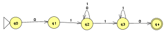
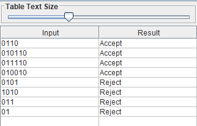
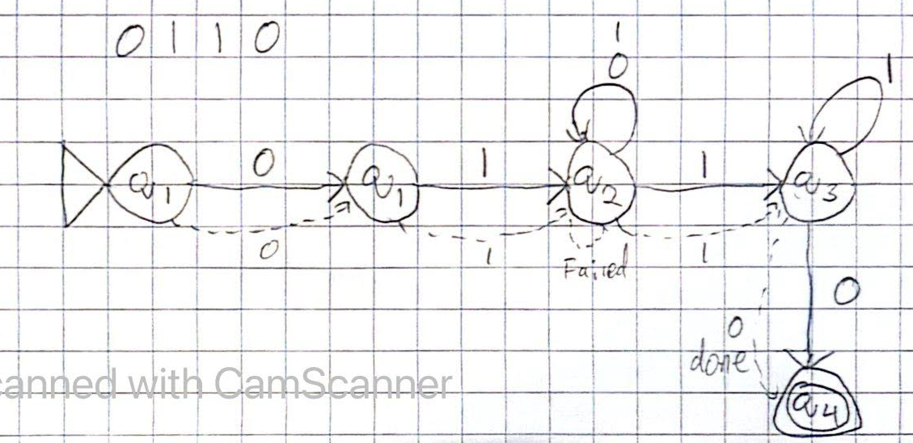
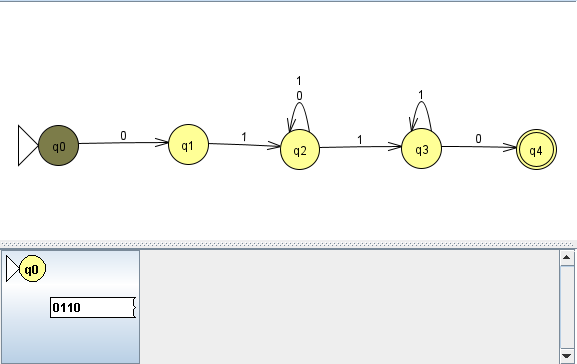
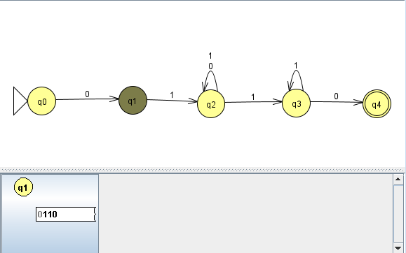
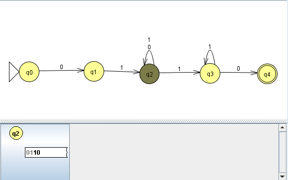
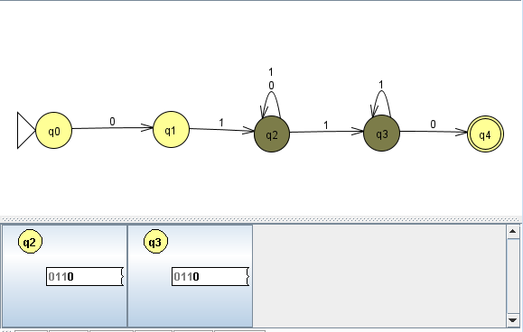
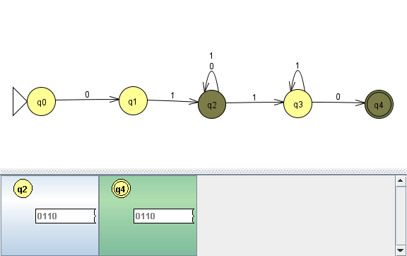
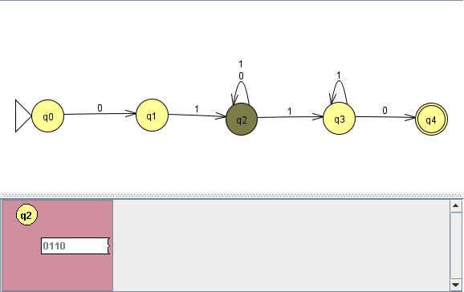

# Problem 8: {string s| s starts with 01 and ends with  10 } 

## NFA Diagram

## Multiple Run Screenshot

## Hand-drawn Tree Computation

## Transition States
**Step 1**

---
**Step 2**

---
**Step 3**

---
**Step 4**

---
**Final Step**

---
**Failed Cycle**

---