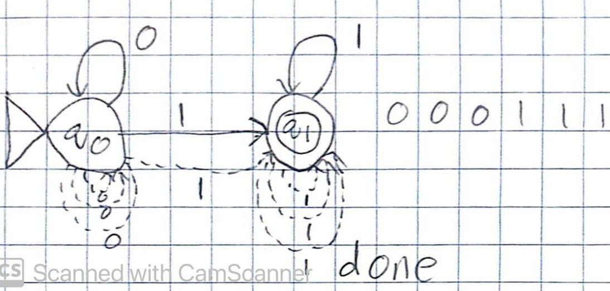
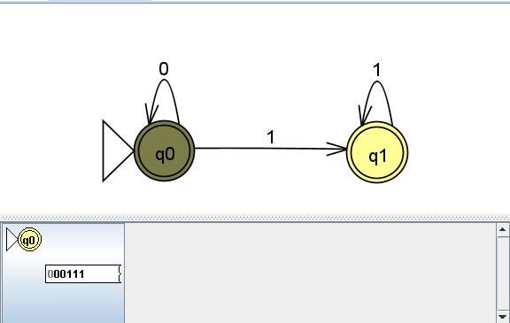
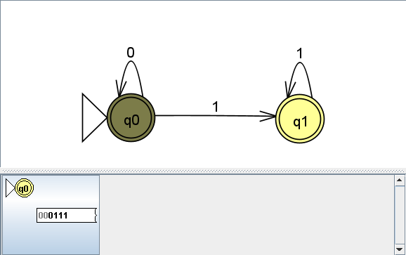
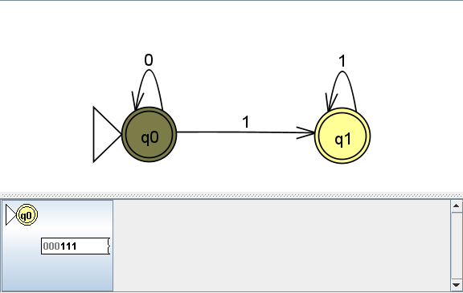
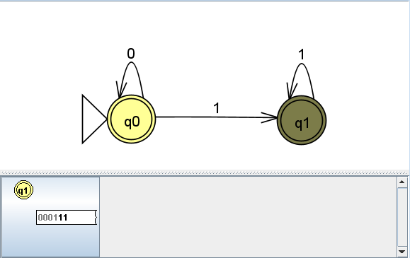
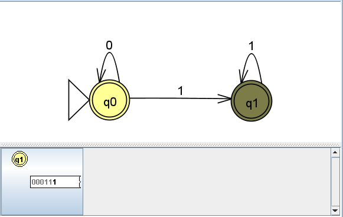
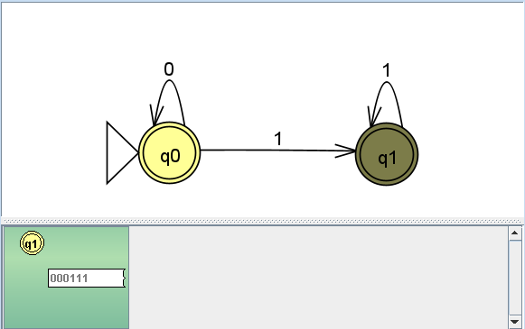

# Problem 10: {string s| s doesn't contains substring 10  } 

## NFA Diagram

## Multiple Run Screenshot

## Hand-drawn Tree Computation

## Transition States
**Step 1**

---
**Step 2**

---
**Step 3**

---
**Step 4**

---
**Step 5**

---
**Step 6**

---
**Final Step**

---